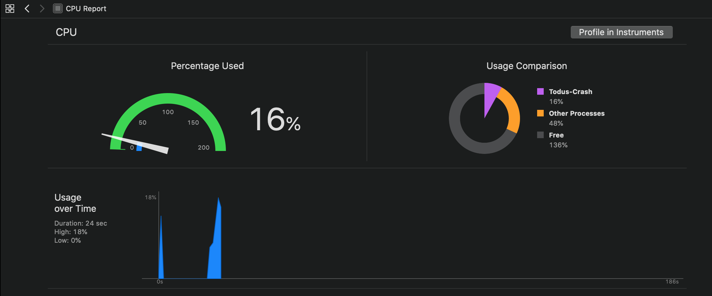
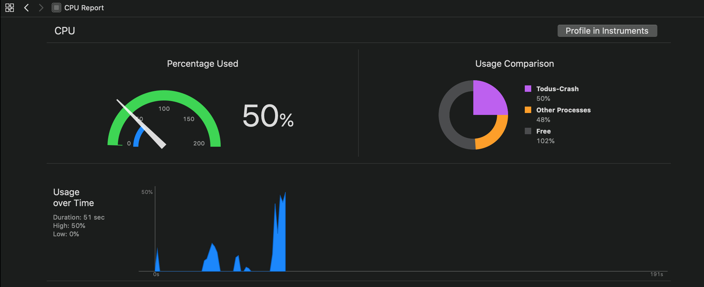

# Todus-Crash SwiftUI 1.0
Sample of crash when a destination view have an item in NavigationView, slow performance updating List

#### 1. Appear the list whit names

When you scroll the list, the cpu performance is normal (9% - 20%)

#### 2. Enter in a Detail row

Sometimes we need an item in our NavigationView, this time I added an trailing item, a simple image (plus)

Here all is normal, now, go back to the list and scroll again .

#### 3. Slow List, Hight CPU Usage (40% or more )

I noted that wired behavior when I added an item in the Navigation stack. If you remove the Navigation Item in Detail view, the issue disapear.  
